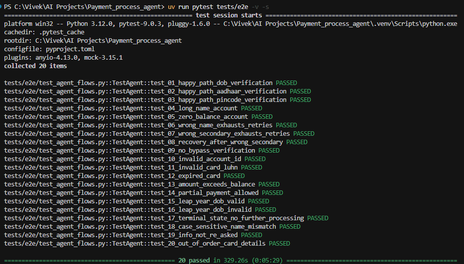

# Payment Collection AI Agent

A production-ready conversational agent that handles end-to-end payment collection:
account lookup → identity verification → card payment processing.

---

## Quick Start

### 1. Install

**Option A — `uv` (recommended, faster)**

```bash
pip install uv          # one-time, if you don't have uv yet
uv sync                 # installs all runtime deps into .venv automatically
uv sync --extra dev     # also installs pytest, ruff, mypy
```

`uv` manages the virtual environment for you — no `python -m venv` or `source activate` needed.
All subsequent commands (`uv run …`) use the venv automatically.

**Option B — plain `pip`**

```bash
python -m venv .venv

# Windows
.venv\Scripts\activate

# macOS / Linux
source .venv/bin/activate

pip install -r requirements.txt
pip install -e .        # installs the package itself in editable mode
```

> `requirements.txt` is generated from the locked `uv.lock` and pins every
> transitive dependency to the exact version used during development.

### 2. Configure

Copy `.env.example` to `.env` and uncomment the block that matches your setup:

| You have | Set these vars |
|---|---|
| Azure OpenAI | `AZURE_OPENAI_ENDPOINT` + `AZURE_OPENAI_API_KEY` + `AZURE_DEPLOYMENT_NAME` |
| OpenAI API key | `OPENAI_API_KEY` (+ optionally `OPENAI_MODEL`) |
| OpenRouter / other | `OPENAI_API_KEY` + `OPENAI_BASE_URL` + `OPENAI_MODEL` |

The agent auto-detects which provider to use based on which variables are set.

### 3. Run interactively

```bash
# uv
uv run python -m apps.cli

# plain pip (venv activated)
python -m apps.cli
```

### 4. Run the evaluation suite

```bash
# uv
uv run python -m pytest tests/e2e -v -s

# plain pip (venv activated)
pytest tests/e2e -v -s
```

---

## Project Structure

```
payment-agent/
├── pyproject.toml                  # primary dependency spec (uv)
├── requirements.txt                # pip-compatible lockfile (generated from uv.lock)
├── .env.example                    # config template — copy to .env
├── .pre-commit-config.yaml
├── docs/
│   ├── design.md                   # architecture & decisions
│   ├── requirements.md             # original problem spec
│   └── conversations.md            # sample transcripts
├── src/payment_agent/
│   ├── agent.py                    # Agent class — public interface
│   ├── config.py                   # Settings, auto-detects Azure/OpenAI/OpenRouter
│   ├── exceptions.py               # typed error taxonomy
│   ├── redaction.py                # mask card numbers / CVV in history
│   ├── models.py                   # Pydantic domain models
│   ├── validators.py               # Luhn, expiry, amount, date — pure functions
│   ├── verification.py             # strict identity match
│   ├── api_client.py               # PaymentAPIClient (retries, idempotency)
│   ├── llm.py                      # build_llm_client + FieldExtractor + ResponseGenerator
│   ├── prompts/                    # system prompt text files
│   └── fsm/                        # state machine + per-state handlers
├── apps/cli.py                     # interactive terminal entrypoint
└── tests/e2e/test_agent_flows.py   # 20 deterministic state-based tests
```

---

## Agent Interface

```python
from payment_agent import Agent

agent = Agent()
result = agent.next("Hello")           # → {"message": str}
result = agent.next("My ID is ACC1001")
result = agent.next("Nithin Jain")
# ... and so on
```

State is maintained internally across all `.next()` calls.

---

## Sample Conversations

### ✅ Successful end-to-end payment

```
Agent : Hello! Welcome to our payment service. Please share your account ID to get started.

User  : ACC1001

Agent : Thank you. I've found your account. To verify your identity, could you please
        provide your full name as registered with us?

User  : Nithin Jain

Agent : Got it. Could you please confirm your date of birth (YYYY-MM-DD),
        the last 4 digits of your Aadhaar, or your pincode?

User  : DOB is 1990-05-14

Agent : Your identity has been verified. Your outstanding balance is ₹1,250.75.
        How much would you like to pay today? You may pay any amount up to ₹1,250.75,
        or say "pay in full" to clear the entire balance.

User  : 500

Agent : Please share your card details: card number, cardholder name, CVV,
        and expiry month and year.

User  : Card number 4532015112830366, name Nithin Jain, CVV 123, expiry 12/2027

Agent : Thank you. Processing your payment of ₹500.00…

        ✅ Payment successful!
        Transaction ID: txn_1762510325322_l1fl4oy
        Amount paid: ₹500.00

        Thank you, Nithin. Is there anything else I can help you with?
```

---

### ❌ Verification failure — retries exhausted

```
Agent : Hello! Please share your account ID to get started.
User  : ACC1001
Agent : Account found. Please provide your full name.

User  : John Smith
Agent : The name provided does not match our records. Please check and re-enter your
        full name exactly as registered. You have 2 attempts remaining.

User  : John Smith
Agent : Verification unsuccessful. You have 1 attempt remaining. Please try again
        with the correct name.

User  : John Smith
Agent : I'm sorry, but we were unable to verify your identity after 3 attempts.
        For security reasons, this session has been closed.
        Please contact our customer support team for further assistance.
```

---

### 💳 Payment failure — invalid card

```
[After verification...]
Agent : Your outstanding balance is ₹1,250.75. How much would you like to pay?
User  : 500
Agent : Please provide your card number, cardholder name, CVV, and expiry date.
User  : Card 1234567890123456, name Nithin Jain, CVV 123, expiry 12/2027
Agent : The card number you entered appears to be invalid (failed security check).
        Please double-check and re-enter your card number.
User  : 4532015112830366
Agent : ✅ Payment of ₹500.00 processed. Transaction ID: txn_...
```

---

### 🔄 Edge case — leap year (ACC1004)

```
Agent : Please provide your identity details.
User  : Rahul Mehta
Agent : Thank you. Date of birth, Aadhaar last 4, or pincode?

User  : 1989-02-29
Agent : The date of birth you entered is not valid — 1989 is not a leap year, so
        February 29 does not exist in that year. Please re-enter your date of birth
        in YYYY-MM-DD format.

User  : 1988-02-29
Agent : Identity verified. Your outstanding balance is ₹3,200.50...
```

---

## Test Accounts

| Account | Name | DOB | Aadhaar Last 4 | Pincode | Balance |
|---------|------|-----|----------------|---------|---------|
| ACC1001 | Nithin Jain | 1990-05-14 | 4321 | 400001 | ₹1,250.75 |
| ACC1002 | Rajarajeswari Balasubramaniam | 1985-11-23 | 9876 | 400002 | ₹540.00 |
| ACC1003 | Priya Agarwal | 1992-08-10 | 2468 | 400003 | ₹0.00 |
| ACC1004 | Rahul Mehta | 1988-02-29 | 1357 | 400004 | ₹3,200.50 |

---

## Evaluation

An automated evaluation suite is included at `tests/e2e/test_agent_flows.py`.
**All 20 tests pass.**

```bash
# uv
uv run python -m pytest tests/e2e -v

# plain pip (venv activated)
pytest tests/e2e -v
```



20 deterministic test cases covering:

| Category | Tests |
|----------|-------|
| Happy path (DOB / Aadhaar / Pincode verification) | 3 |
| Long name account | 1 |
| Zero balance | 1 |
| Verification failures (wrong name / secondary / retries) | 5 |
| Payment failures (Luhn / expired / over-balance) | 3 |
| Partial payment | 1 |
| Edge cases (leap year, case sensitivity, out-of-order input) | 5 |

Tests assert on `agent.state`, `agent.verified`, and `agent.payment_result` —
not on LLM-generated text — making them deterministic and stable across runs
regardless of LLM response phrasing.

---

## Key Design Decisions

> Full rationale is in [`docs/design.md`](docs/design.md). Summarised here for quick review.

**Verification retry limit — 3 attempts**
Industry standard for high-friction identity flows (banks, call-centre scripts). Low enough to deter brute-forcing; high enough that a genuine user who mis-types once can still succeed. On exhaustion the session transitions to `FAILED` and the user is directed to support. Correct values are never revealed.

**Invalid date format does not consume a retry**
If a user enters `1989-02-29` (not a leap year), the date is structurally wrong — not a genuine failed attempt. The agent re-prompts for a valid date without decrementing the attempt counter.

**Zero-balance account (ACC1003) — verified but no payment collected**
After verification the agent informs the user there is nothing owed and closes gracefully. Entering the payment collection state with ₹0.00 balance would confuse the user and serve no purpose.

**Leap year date validation (ACC1004 — DOB `1988-02-29`)**
`datetime.date(year, month, day)` raises `ValueError` for non-existent dates (e.g. `1989-02-29`). The validator catches this and returns a clear error message. `1988-02-29` is a real date (1988 is divisible by 4) and passes correctly.

**Terminal vs retryable payment failures**
User-fixable errors (`invalid_card`, `invalid_cvv`, `invalid_expiry`, `insufficient_balance`, `invalid_amount`) → clear the bad field, re-prompt.
Unknown API errors → transition to `FAILED`, apologise, direct to support. The distinction is made by checking the `error_code` from the API response against a known set.

**LLM never makes business decisions**
The LLM is used only for (1) extracting structured fields from free text and (2) generating natural language replies. All pass/fail decisions — verification, validation, state transitions, API calls — are pure Python. This makes the agent auditable, testable, and impossible to "jailbreak" into skipping a step.
